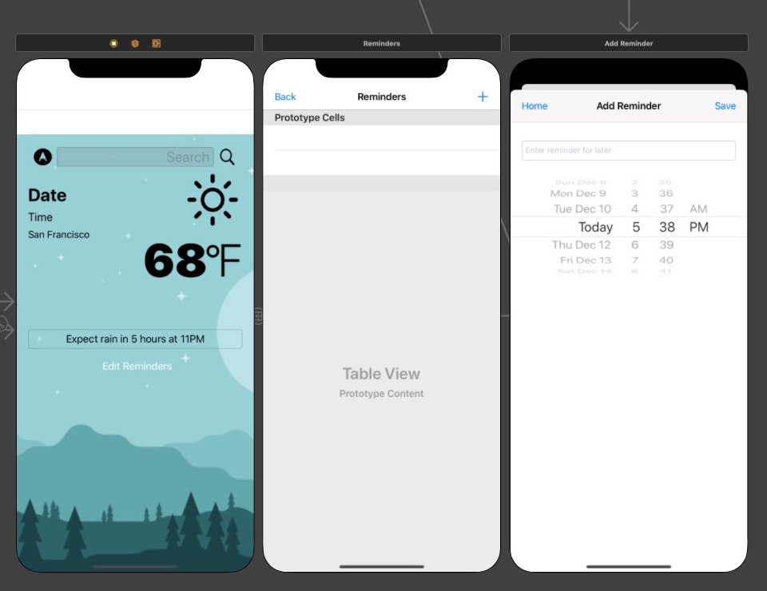

# Weather Dog

A weather app tailored towards pet owners that depend on good weather conditions to walk their pets. 

Weather Dog ensures optimized walks by alerting owners of mal-weather (rain, sleet, hail, snow, natural disasters) so that they can plan their walks accorddingly. Pet owners will be able to rest assure that even if they forget to check the weather that day, or if an unexpected storm is on the horizon, Weather Dog has their back with the built in alert system. 
 
 ## Installation 
 **NOTE:** This app has not yet launched to the app store and is still in the process of being polished. In order to preview this app, you will need to clone this repository and open it in Xcode
 - If you do not have Xcode you can download it [here](https://developer.apple.com/xcode/)
 - After cloning, be sure to enable privacy and notifications settings for the app to work
 
 **NOTE:** If you are attempting to recreate this app: sign up for [Open Weather](https://openweathermap.org/api) and [Dark Sky](https://darksky.net/dev) to obtain your own API Keys

 ### Preview

### Current Features 
- Automatically see the weather in your current location 
- Be able to search any city in the world and see the weather there too! 
- Get automatic alerts AND be able to set your own custom alerts and reminders to walk your furry buddy 

### Features to Look Forward To 
- GeoMap of incoming storms and current weather 
- More data on the weather (level of precipitation, humidity, etc) 
- Suggestion for the best time to walk your pet within a two hour window 

**Coming soon to App Store!**
